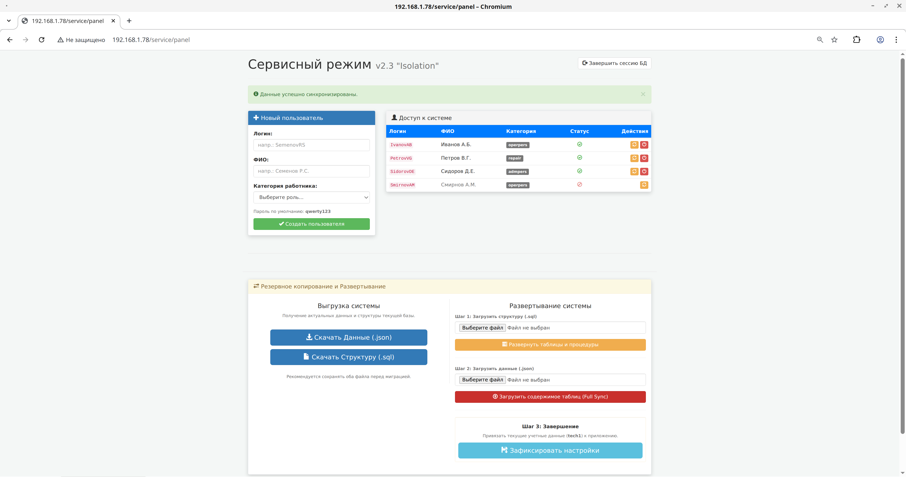
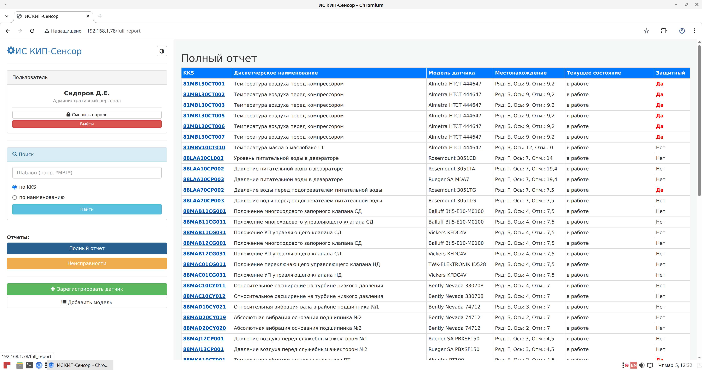

# ИС КИП-Сенсор

Информационная система для оперативного учёта измерительного парка промышленного предприятия с поддержкой системы KKS

## Серверная часть

состоит из связвки MariaDB (также полностью совместима с MySQL) -> Python Flask -> Python mod_wsgi -> Apache2 (httpd).

Предпочтительная ОС для развёртывания РЕД ОС 8. В неё развёртывание происходит в автоматическом режиме и протестировано. Также протестировано в Ubuntu 24.04.
100% должно работать в любом современном Linux-дистрибутиве общего назначения, но потребуется правка 'app/*.wsgi' и '/etc/apache2/sites-available/projectname.conf'
**Не на Linux** тоже должно работать везде, где есть Apache, Python, MariaDB и mod_wsgi (последний пункт может вызвать проблемы)
Впрочем, можно взять вместо Apache любой другой web-сервер, "дружащий" с Flask, но тогда систему придётся разворачивать нечерез web-интерфейс, а сразу в СУБД

## Клиентская часть

состоит из любого современного браузера. Что угодно на Chromium, Firefox, Safari. Просто введите ip-адрес сервера в строке браузера.

